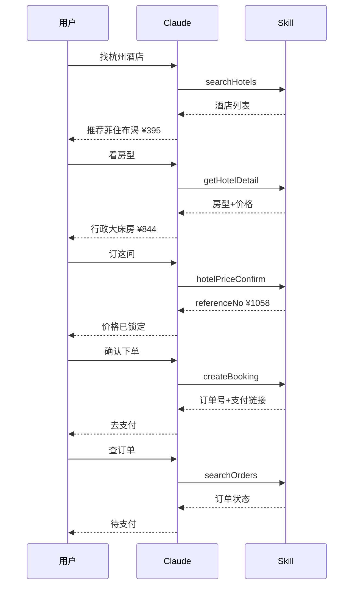

# RollingGo Hotel Skills

[English](#english) | [简体中文](#简体中文)

```text
  ██████╗  ██████╗ ██╗     ██╗     ██╗███╗   ██╗ ██████╗  ██████╗  ██████╗ 
  ██╔══██╗██╔═══██╗██║     ██║     ██║████╗  ██║██╔════╝ ██╔════╝ ██╔═══██╗
  ██████╔╝██║   ██║██║     ██║     ██║██╔██╗ ██║██║  ███╗██║  ███╗██║   ██║
  ██╔══██╗██║   ██║██║     ██║     ██║██║╚██╗██║██║   ██║██║   ██║██║   ██║
  ██║  ██║╚██████╔╝███████╗███████╗██║██║ ╚████║╚██████╔╝╚██████╔╝╚██████╔╝
  ╚═╝  ╚═╝ ╚═════╝ ╚══════╝╚══════╝╚═╝╚═╝  ╚═══╝ ╚═════╝  ╚═════╝  ╚═════╝ 
            ██╗  ██╗ ██████╗ ████████╗███████╗██╗     
            ██║  ██║██╔═══██╗╚══██╔══╝██╔════╝██║     
            ███████║██║   ██║   ██║   █████╗  ██║     
            ██╔══██║██║   ██║   ██║   ██╔══╝  ██║     
            ██║  ██║╚██████╔╝   ██║   ███████╗███████╗
            ╚═╝  ╚═╝ ╚═════╝    ╚═╝   ╚══════╝╚══════╝
            
  ──●────●────●────●────●────●──
   AI Skills for Claude • Cursor • Copilot
```

Search → Detail → Price Confirm → Book → Orders


---

只需对 Agent 说一句「我要去 XX 玩，帮我订酒店」

RollingGo酒店预订Skill就能帮你全程搞定：

🔍 按需求**智能筛选**，省心帮你挑酒店

📋 实时查**房型、报价和退改规则**，明明白白不踩坑

🛏️ 心仪房型提前**锁定**，不用愁晚订没房

🔐 无需切换其他平台，Agent内一键安全**登录**，隐私信息有保障

💳 说句“帮我下单”就跳转支付宝**直接付**

📑 订单状态随时能查，全程都省心

💴 还能设置24 小时自动**盯价**，降价马上**提醒**

全球酒店**实时推荐**及**闭环预订**，不用自己蹲点比价，不用纠结早订亏、晚订无，订酒店的烦心事，一句话帮你全打理妥当。


## ✨ Skill亮点

- ✅ **原生智能交互** - Agent-Native原生交互设计，自然对话即可完成预订全流程
- ✅ **实时库存价确** - 库存直连+实时价格确认能力，信息零延迟，查询结果均可直接预订
- ✅ **成熟供应链保障** - 全球第三大酒旅B2B官方数据源，14年旅行产品供应链积累，全链路API直连
- ✅ **海量酒店覆盖** - 坐拥200万+酒店资源，覆盖全球主要目的地
- ✅ **直签酒店资源** - 11万+直签酒店直连，价格库存实时响应，确保查询结果准确可订
- ✅ **多元供应体系** - 整合500+全球供应商，涵盖各类酒店品牌，满足不同用户预订需求
- ✅ **差异化价格优势** - 锚定OTA上游供应，海外酒店及上海、香港、日韩等热门目的地价格优势显著
- ✅ **兼容性** - 支持 Cursor、Claude Code、Codex、Windsurf、Copilot 等 40 多种主流大模型代理


## ✨ 安装方式

### 通过 npx skills 安装 (推荐)
自动兼容 Cursor, Claude Code, Windsurf 等 40+ 种代理：

```bash
# 交互式安装 (推荐，可从菜单中自由勾选不同能力模块)
npx skills add https://github.com/RollingGo-AI/hotel-skill

# 或直接定向安装特定核心模块 (跳过交互选单)
npx skills add https://github.com/RollingGo-AI/hotel-skill --skill hotel-core
```

CLI 会自动检测您系统上安装的 Agent。您也可以通过 `--agent` 强制指定目标环境：

```bash
npx skills add https://github.com/RollingGo-AI/hotel-skill --agent cursor
```

### 手动克隆/复制

克隆本仓库，将 `skills/hotel-core/` 文件夹直接放入您 Agent 对应的技能目录即可：

| 代理工具 | 本地技能存放目录 |
|-------|-----------------|
| Claude Code | `~/.claude/skills/` |
| Cursor | `~/.cursor/skills/` |
| OpenAI Codex | `~/.codex/skills/` |
| Windsurf | `~/.windsurf/skills/` |
| Google Antigravity | `~/.gemini/antigravity/skills/` |

### 核心能力清单
| 指令 | 业务描述 |
|-------|-------------|
| **`rgh login`** | OAuth 2.1 PKCE 免密安全授权 |
| **`rgh search-hotels`** | 支持按地标、日期、标签多维度检索酒店 |
| **`rgh hotel-detail`** | 实时拉取酒店房型、最新报价与退改政策 |
| **`rgh price-confirm`** | 锁定房间价格并生成交易参考号 `referenceNo` |
| **`rgh book`** | 提交预订入住人信息，返回真实的支付宝付款链接 |
| **`rgh orders`** | 查阅历史订单及最新支付状态 |

### 大模型操作 SOP (标准作业程序)
要求 AI 建议或自动执行的规范代码流：

```bash
# 1. 首先检查用户登录状态
rgh whoami
# -> 如果未登录，引导用户先执行 `rgh login`

# 2. 检索意向酒店（例如：下周的上海酒店）
rgh search-hotels --place "Shanghai" --check-in-date 2026-06-20

# 3. 将搜索结果用 Markdown 呈现给用户。待用户挑选后，获取详情：
rgh hotel-detail --hotel-id 12345 --check-in-date 2026-06-20

# 4. 用户确定房型后，进行锁价预订 (此步为高风险，必须要求用户确认！)
rgh price-confirm --hotel-id 12345 --rate-plan-id "RP01" --rooms 1 --check-in-date 2026-06-20 --check-out-date 2026-06-21 --adults 2

# 5. 在用户同意上述锁定的价格并提供姓名邮箱后，正式下单：
rgh book --reference-no "REF9999" --first-name "San" --last-name "Zhang" --email "zhangsan@example.com"
```


---
## ✨ 效果演示

以下展示通过 Claude Code 预订酒店的完整对话流程。无需了解任何技术细节，只需用自然语言对话即可完成从搜索到支付的全部步骤。

### 2.1 说需求

```
用户：我下周三要去杭州出差，帮我在西溪湿地附近找个酒店，2 人住 1 晚，要 4 星以上、有免费 WiFi
```

Claude 自动调用 `searchHotels`：

```json
{
  "originQuery": "杭州西溪湿地附近酒店，2人入住1晚，4星以上，免费WiFi",
  "place": "西溪湿地",
  "placeType": "景点",
  "size": 5,
  "checkInParam": {
    "checkInDate": "2026-06-11",
    "stayNights": 1,
    "adultCount": 2
  },
  "filterOptions": { "starRatings": [4.0, 5.0] },
  "hotelTags": { "preferredTags": ["免费WiFi"] }
}
```

返回：

```
Claude: 找到以下酒店：

  酒店                                    星级    距离    最低价
  ─────────────────────────────────────── ────── ────── ────────
  杭州阿里巴巴园区菲住布渴酒店            ⭐4.0  2.9km  ¥395/晚
  杭州西溪喜来登度假大酒店                ⭐5.0  1.2km  ¥1,280/晚
  ...

  你想看哪家的房型详情？
```

---

### 2.2 选酒店、看房型

```
用户：菲住布渴看起来不错，看看有什么房型
```

Claude 调用 `getHotelDetail`，返回：

```
Claude: 杭州阿里巴巴园区菲住布渴酒店 房型：

  房型                                              床型      总价     取消政策
  ───────────────────────────────────────────────── ──────── ──────── ──────────────
  行政大床房（金可儿床垫+智能马桶+戴森吹风机）      1 大床   ¥844     6月8日前免费取消
  豪华双床房                                        2 单人床 ¥698     6月8日前免费取消
  高级大床房                                        1 大床   ¥520     不可取消

  要订哪个房型？
```

---

### 2.3 确认房型、锁价

```
用户：行政大床房吧，含早吗？
```

Claude 从详情数据中找到餐食信息回答后，调用 `hotelPriceConfirm` 锁价：

```
Claude: ✅ 价格已锁定！

  酒店      杭州阿里巴巴园区菲住布渴酒店
  房型      行政大床房（金可儿床垫+智能马桶+戴森吹风机）
  日期      2026-06-11 → 2026-06-12（1 晚）
  总价      ¥1,058（含税含早）
  取消政策  6月8日前免费取消
  ⏰ 价格有效期  约 30 分钟

  确认下单吗？请提供入住人姓名和邮箱。
```

> [!warning] referenceNo 有时效
> 价格锁定有效期约 30 分钟。用户犹豫太久 Claude 会自动重新锁价。

---

### 2.4 确认下单、支付

```
用户：确认，入住人张三，邮箱 zhangsan@example.com
```

Claude 调用 `createHotelBookingWithAlipayUrl`：

```
Claude: ✅ 订单已创建！

  订单号  H178064206320601631
  状态    待支付

  👉 点击这里用支付宝支付: https://openapi.alipay.com/gateway.do?...

  支付完成后，你可以说"查看我的订单"来确认。
```

---

### 2.5 查订单

```
用户：我的订单
```

Claude 调用 `searchHotelOrders`，返回：

```
Claude: 你有 1 笔酒店订单：

  订单号      H178064206320601631
  酒店        杭州阿里巴巴园区菲住布渴酒店
  房型        行政大床房（金可儿床垫+智能马桶+戴森吹风机）
  入住日期    2026-06-11 → 2026-06-12（1 晚）
  总价        ¥1,058
  支付状态    待支付（CREATED）
  入住人      张三
  酒店电话    0571-87217777
  入住时间    15:00 后入住，12:00 前退房

  需要我帮你做什么？比如查看详情或取消订单。
```

---

### 2.6 完整对话链路



---

### 风险等级
**中等风险 (MODERATE)** — 此技能可触发真实的现实世界酒店客房交易。已通过严格的两步确认机制拦截未经授权的 `book` 调用。
为 **RollingGo 酒店命令行工具** (`@rollinggo/hotel`) 量身定制的官方 AI 技能库。它能够教会各类 AI 代理正确的酒店预订流程、OAuth 2.1 PKCE 登录流，以及如何安全地在终端内触发真实的酒店交易。兼容 [skills CLI](https://github.com/vercel-labs/skills) 规范.给 AI 代理的提示：当用户要求**预订酒店**、**查询空房**或**查看订单**时，请按顺序使用 `rgh` 命令。绝对不要向用户泄露原始的 `hotelId` 或 `referenceNo` 等系统内部 ID，请将结果格式化为美观的 Markdown 卡片。

> **安全警告**：本工具直接连接真实交易系统。技能库已向 AI 代理下达严格的“死命令”：**在未经用户明确确认价格和支付意愿前，绝不允许私自发起任何订单**。


---

## Structure / 代码架构
```text
RollingGo-Skills/
  ├── README.md               # Main orchestrator and SEO entry / 主入口与 SEO 文案
  ├── AGENTS.md               # Directives for AI web crawlers / 针对 AI 爬虫的全局指令
  ├── .github/
  │    └── copilot-instructions.md
  └── skills/
       ├── llms.txt           # AI Index for search engines / 大模型全局搜索索引
       └── hotel-core/        # Core hotel booking skill / 核心酒店预订功能包
            ├── SKILL.md
            └── references/
                 └── cli-params.md
```

## License
MIT


## English

Official AI skills for the **RollingGo Hotel CLI** (`@rollinggo/hotel`). They teach agents the correct booking sequence, OAuth 2.1 PKCE login flow, and how to safely trigger end-to-end hotel transactions from the terminal. Works with the [skills CLI](https://github.com/vercel-labs/skills) (Cursor, Claude Code, Codex, Windsurf, Copilot, 40+ agents).

> **Important**: This CLI acts as a bridge to real-world bookings. AI agents are strictly instructed to **NEVER place an order without explicit price confirmation from the user**.

**For AI agents:** When the user asks to **book a hotel**, **search for rooms**, or **check their orders**, use the `rgh` CLI commands sequentially. Never leak `hotelId` or `referenceNo` directly to the user; format results into user-friendly Markdown.

### npx skills (recommended)
Works with Cursor, Claude Code, Codex, Windsurf, Copilot, Google Antigravity, and 40+ agents:

```bash
# Install interactively (Select skills from menu)
npx skills add https://github.com/RollingGo-AI/hotel-skill

# Or install a specific skill directly (e.g., hotel-core)
npx skills add https://github.com/RollingGo-AI/hotel-skill --skill hotel-core
```

The CLI auto-detects the installed agent. To target one explicitly, pass `--agent`:

```bash
npx skills add https://github.com/RollingGo-AI/hotel-skill --agent cursor
```

### Clone / copy

Clone this repo and copy the `skills/hotel-core/` folder into the appropriate directory for your agent:

| Agent | Skill Directory |
|-------|-----------------|
| Claude Code | `~/.claude/skills/` |
| Cursor | `~/.cursor/skills/` |
| OpenAI Codex | `~/.codex/skills/` |
| Windsurf | `~/.windsurf/skills/` |
| Google Antigravity | `~/.gemini/antigravity/skills/` |

### Capabilities
| Command | Description |
|-------|-------------|
| **`rgh login`** | OAuth 2.1 PKCE Authorization |
| **`rgh search-hotels`** | Search hotels by location, dates, tags |
| **`rgh hotel-detail`** | View room types, live prices, cancellation policies |
| **`rgh price-confirm`** | Lock a price and generate a booking `referenceNo` |
| **`rgh book`** | Finalize order with guest info, returns Alipay link |
| **`rgh orders`** | View historical orders and their payment status |

### Quick reference (for AI agents)
Canonical order sequence to suggest or generate:

```bash
# 1. Start with checking login status
rgh whoami
# -> If not logged in, prompt user to run `rgh login`

# 2. Search for hotels (e.g. Shanghai next week)
rgh search-hotels --place "Shanghai" --check-in-date 2026-06-20

# 3. Present options to user and get their choice. Then fetch details:
rgh hotel-detail --hotel-id 12345 --check-in-date 2026-06-20

# 4. Once user picks a room and rate plan, lock the price (Requires user confirmation!)
rgh price-confirm --hotel-id 12345 --rate-plan-id "RP01" --rooms 1 --check-in-date 2026-06-20 --check-out-date 2026-06-21 --adults 2

# 5. After the user approves the locked price and provides their Name/Email:
rgh book --reference-no "REF9999" --first-name "San" --last-name "Zhang" --email "zhangsan@example.com"
```

### Risk level
**MODERATE** — Can trigger real-world hotel reservations. The skill enforces a strict two-step confirmation gate before making any `book` calls.

---

